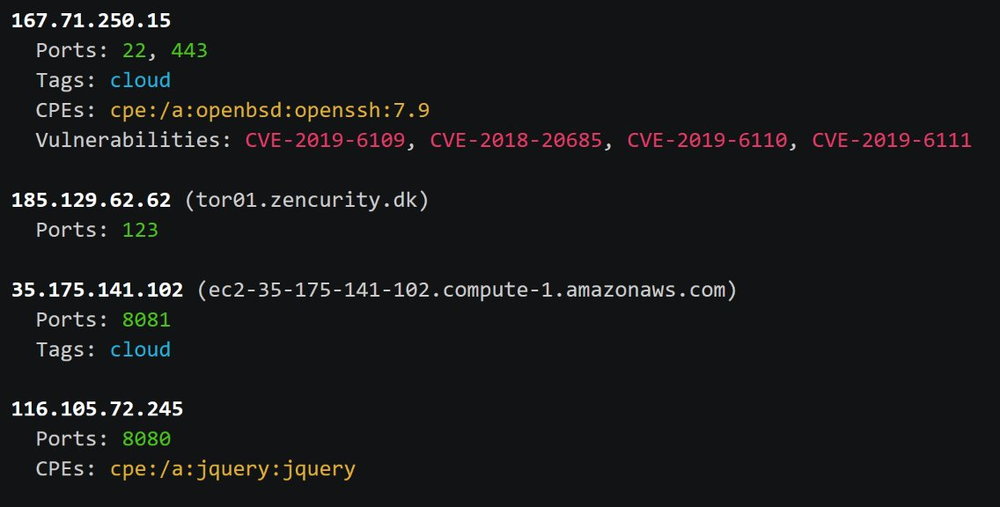

# nrich

A command-line tool to quickly analyze all IPs in a file and see which ones have open ports/ vulnerabilities. Can also be fed data from stdin to be used in a data pipeline.

<p>
<a href="https://opensource.org/licenses/GPL-3.0"></a>
<a href="https://rust-reportcard.xuri.me/report/gitlab.com/shodan-public/nrich"></a>
<a href="https://twitter.com/shodanhq"></a>
</p>



``nrich`` fetches information via the [InternetDB API](https://internetdb.shodan.io) and the vulnerability assessment technique is [documented in the help center](https://help.shodan.io/mastery/vulnerability-assessment).

## Installation

Grab the [latest release](https://gitlab.com/shodan-public/nrich/-/releases) for your operating system. For example, to install the ``nrich`` command in Ubuntu:

```shell
$ wget https://gitlab.com/api/v4/projects/33695681/packages/generic/nrich/latest/nrich_latest_amd64.deb
$ sudo dpkg -i nrich_latest_amd64.deb
```

To confirm that it's working you can pipe an IP to the command. For example:

```shell
$ echo 149.202.182.140 | nrich -
149.202.182.140 (ftptech1.pcsoft.fr)
  Ports: 21, 80, 111, 443
  CPEs: cpe:/a:proftpd:proftpd:1.3.5b, cpe:/a:apache:http_server:2.4.25
  Vulnerabilities: CVE-2018-11763, CVE-2019-0220, CVE-2017-15710, CVE-2018-1312, CVE-2019-0197, CVE-2017-9798, CVE-2018-1283, CVE-2017-7668, CVE-2017-3169, CVE-2017-15715, CVE-2017-7659, CVE-2018-1333, CVE-2019-0211, CVE-2019-12815, CVE-2017-3167, CVE-2017-9788, CVE-2019-0196, CVE-2017-7679, CVE-2018-17199

```

## Usage

The ``nrich`` command only requires a single argument: the filename that contains the IPs:

```shell
$ nrich --help
nrich 0.1.0
Add network information to IPs

USAGE:
    nrich [OPTIONS] <filename>

FLAGS:
    -h, --help       Prints help information
    -V, --version    Prints version information

OPTIONS:
    -o, --output <output>    Output format (shell or json) [default: shell]

ARGS:
    <filename>    File containing an IP per line. Non-IPs are ignored
```

Here is a short video that shows how to install ``nrich`` and then run it against a list of emerging threats:

[](https://asciinema.org/a/468923)
